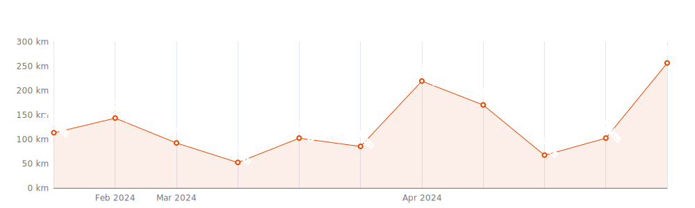
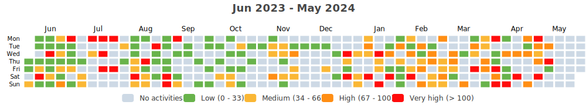
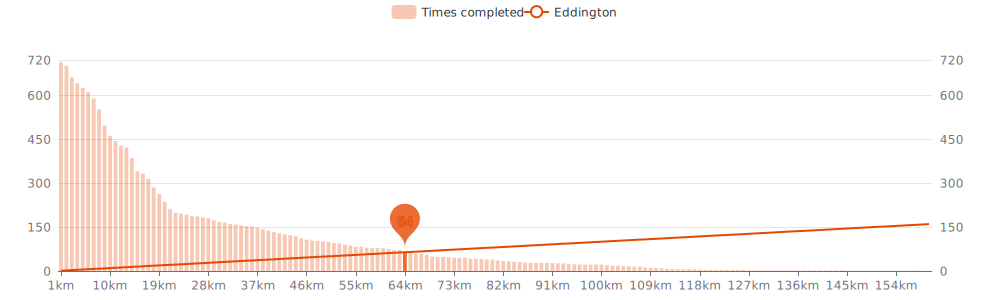

    

Since I began cycling `10 years and 2 months` ago on `12-07-2014`,
I had `624 cycling days`. 
I recorded a total distance of `14 547 km`
(`0.36` trips around the world 🌍 and
`0.038` trips to the moon 🌕),
an elevation of `57 013 m`
(`6.4` times Mount Everest 🏔)
and a total time of `3w 6d 22h 24m` 🎉

That's a daily average of `4 km`,
a weekly average of `30 km` and a
monthly average of `128 km` 🐣

I burned `339749 calories` doing so, that's about `1 258` pizza slices 🍕

---

<kbd><a href="#weekly-distances">Weekly distances</a></kbd> |
<kbd><a href="#activities">Activities</a></kbd> |
<kbd><a href="#monthly-stats">Monthly stats</a></kbd> |
<kbd><a href="#activity-intensity">Activity intensity</a></kbd> |
<kbd><a href="#stats-per-weekday">Stats per weekday</a></kbd> |
<kbd><a href="#daytime-stats">Daytime stats</a></kbd> |
<kbd><a href="#stats-per-bike">Stats per bike</a></kbd> |
<kbd><a href="#best-power-outputs-over-time">Power outputs</a></kbd> |
<kbd><a href="#eddington-chart">Eddington</a></kbd> |
<kbd><a href="#distance-breakdown">Distance breakdown</a></kbd> |
<kbd><a href="#challenge-consistency">Challenge consistency</a></kbd> |
<kbd><a href="#completed-challenges">Completed challenges</a></kbd>

## Weekly distances

## Activities

<table>
    <tr>
        <th></th>
        <th></th>
        <th align="center"></th>
        <th align="center"></th>
        <th align="center"></th>
        <th align="center"></th>
        <th align="center"></th>
        <th align="center"></th>
    </tr>
            <tr>
            <td>12-12-23</td>
            <td>
                
                <a href="https://www.strava.com/activities/10366886669" title="Kcal: 120 | Gear: Stadsfiets ">Morning Ride 🚃</a>
            </td>
            <td align="center">4 km</td>
            <td align="center">0 m</td>
            <td align="center">11:27</td>
            <td align="center">72 w</td>
            <td align="center">22.5 km/h</td>
            <td align="center">145</td>
        </tr>
            <tr>
            <td>05-12-23</td>
            <td>
                
                <a href="https://www.strava.com/activities/10330523216" title="Kcal: 100 | Gear: Stadsfiets ">Morning Ride 🚃</a>
            </td>
            <td align="center">4 km</td>
            <td align="center">0 m</td>
            <td align="center">11:00</td>
            <td align="center">72 w</td>
            <td align="center">23.7 km/h</td>
            <td align="center">130</td>
        </tr>
            <tr>
            <td>28-11-23</td>
            <td>
                
                <a href="https://www.strava.com/activities/10296170767" title="Kcal: 100 | Gear: Stadsfiets ">Afternoon Ride 🚃</a>
            </td>
            <td align="center">4 km</td>
            <td align="center">0 m</td>
            <td align="center">12:01</td>
            <td align="center">63 w</td>
            <td align="center">21.6 km/h</td>
            <td align="center">125</td>
        </tr>
            <tr>
            <td>28-11-23</td>
            <td>
                
                <a href="https://www.strava.com/activities/10293472859" title="Kcal: 104 | Gear: Stadsfiets ">Morning Ride 🚃</a>
            </td>
            <td align="center">4 km</td>
            <td align="center">2 m</td>
            <td align="center">11:23</td>
            <td align="center">69 w</td>
            <td align="center">22.8 km/h</td>
            <td align="center">130</td>
        </tr>
            <tr>
            <td>25-11-23</td>
            <td>
                
                <a href="https://www.strava.com/activities/10279533299" title="Kcal: 739 | Gear: Tacx ">Afternoon Ride</a>
            </td>
            <td align="center">39 km</td>
            <td align="center">0 m</td>
            <td align="center">1:16:00</td>
            <td align="center">162 w</td>
            <td align="center">31 km/h</td>
            <td align="center">136</td>
        </tr>
        </table>

    
Older activities

    <table>
        <tr>
            <th></th>
            <th></th>
            <th align="center"></th>
            <th align="center"></th>
            <th align="center"></th>
            <th align="center"></th>
            <th align="center"></th>
            <th align="center"></th>
        </tr>
                    <tr>
                <td>24-11-23</td>
                <td>
                    
                    <a href="https://www.strava.com/activities/10274823684" title="Kcal: 226 | Gear: Stadsfiets ">Evening Ride 🚃</a>
                </td>
                <td align="center">8 km</td>
                <td align="center">16 m</td>
                <td align="center">26:03</td>
                <td align="center">55 w</td>
                <td align="center">19.5 km/h</td>
                <td align="center">129</td>
            </tr>
                    <tr>
                <td>24-11-23</td>
                <td>
                    
                    <a href="https://www.strava.com/activities/10272076102" title="Kcal: 164 | Gear: Stadsfiets ">Morning Ride 🚃</a>
                </td>
                <td align="center">8 km</td>
                <td align="center">12 m</td>
                <td align="center">21:07</td>
                <td align="center">83 w</td>
                <td align="center">23.9 km/h</td>
                <td align="center">122</td>
            </tr>
                    <tr>
                <td>22-11-23</td>
                <td>
                    
                    <a href="https://www.strava.com/activities/10264993943" title="Kcal: 597 | Gear: Tacx ">Night Ride</a>
                </td>
                <td align="center">30 km</td>
                <td align="center">0 m</td>
                <td align="center">58:00</td>
                <td align="center">172 w</td>
                <td align="center">31.4 km/h</td>
                <td align="center">139</td>
            </tr>
                    <tr>
                <td>22-11-23</td>
                <td>
                    
                    <a href="https://www.strava.com/activities/10263377560" title="Kcal: 109 | Gear: Stadsfiets ">Afternoon Ride 🚃</a>
                </td>
                <td align="center">4 km</td>
                <td align="center">0 m</td>
                <td align="center">12:19</td>
                <td align="center">58 w</td>
                <td align="center">21 km/h</td>
                <td align="center">127</td>
            </tr>
                    <tr>
                <td>22-11-23</td>
                <td>
                    
                    <a href="https://www.strava.com/activities/10260769750" title="Kcal: 104 | Gear: Stadsfiets ">Morning Ride 🚃</a>
                </td>
                <td align="center">4 km</td>
                <td align="center">0 m</td>
                <td align="center">11:05</td>
                <td align="center">74 w</td>
                <td align="center">23.4 km/h</td>
                <td align="center">131</td>
            </tr>
                    <tr>
                <td>21-11-23</td>
                <td>
                    
                    <a href="https://www.strava.com/activities/10258147376" title="Kcal: 104 | Gear: Stadsfiets ">Evening Ride 🚃</a>
                </td>
                <td align="center">4 km</td>
                <td align="center">0 m</td>
                <td align="center">12:03</td>
                <td align="center">55 w</td>
                <td align="center">21.5 km/h</td>
                <td align="center">126</td>
            </tr>
                    <tr>
                <td>21-11-23</td>
                <td>
                    
                    <a href="https://www.strava.com/activities/10254917804" title="Kcal: 79 | Gear: Stadsfiets ">Morning Ride 🚃</a>
                </td>
                <td align="center">4 km</td>
                <td align="center">0 m</td>
                <td align="center">11:16</td>
                <td align="center">76 w</td>
                <td align="center">23.1 km/h</td>
                <td align="center">115</td>
            </tr>
                    <tr>
                <td>19-11-23</td>
                <td>
                    
                    <a href="https://www.strava.com/activities/10245399715" title="Kcal: 145 | Gear: Stadsfiets ">Afternoon Ride</a>
                </td>
                <td align="center">5 km</td>
                <td align="center">5 m</td>
                <td align="center">17:19</td>
                <td align="center">39 w</td>
                <td align="center">16.5 km/h</td>
                <td align="center">126</td>
            </tr>
                    <tr>
                <td>19-11-23</td>
                <td>
                    
                    <a href="https://www.strava.com/activities/10245398612" title="Kcal: 106 | Gear: Stadsfiets ">Morning Ride</a>
                </td>
                <td align="center">5 km</td>
                <td align="center">7 m</td>
                <td align="center">14:28</td>
                <td align="center">55 w</td>
                <td align="center">19.1 km/h</td>
                <td align="center">118</td>
            </tr>
                    <tr>
                <td>18-11-23</td>
                <td>
                    
                    <a href="https://www.strava.com/activities/10241758291" title="Kcal: 703 | Gear: Tacx ">Evening Ride</a>
                </td>
                <td align="center">37 km</td>
                <td align="center">0 m</td>
                <td align="center">1:10:44</td>
                <td align="center">166 w</td>
                <td align="center">31.1 km/h</td>
                <td align="center">136</td>
            </tr>
                    <tr>
                <td>16-11-23</td>
                <td>
                    
                    <a href="https://www.strava.com/activities/10230691315" title="Kcal: 94 | Gear: Stadsfiets ">Afternoon Ride 🚃</a>
                </td>
                <td align="center">4 km</td>
                <td align="center">0 m</td>
                <td align="center">12:12</td>
                <td align="center">54 w</td>
                <td align="center">21.3 km/h</td>
                <td align="center">121</td>
            </tr>
                    <tr>
                <td>16-11-23</td>
                <td>
                    
                    <a href="https://www.strava.com/activities/10226917465" title="Kcal: 105 | Gear: Stadsfiets ">Morning Ride 🚃</a>
                </td>
                <td align="center">4 km</td>
                <td align="center">0 m</td>
                <td align="center">11:46</td>
                <td align="center">66 w</td>
                <td align="center">21.9 km/h</td>
                <td align="center">129</td>
            </tr>
                    <tr>
                <td>15-11-23</td>
                <td>
                    
                    <a href="https://www.strava.com/activities/10222672409" title="Kcal: 201 | Gear: Stadsfiets ">Afternoon Ride</a>
                </td>
                <td align="center">7 km</td>
                <td align="center">10 m</td>
                <td align="center">22:49</td>
                <td align="center">52 w</td>
                <td align="center">19.5 km/h</td>
                <td align="center">130</td>
            </tr>
                    <tr>
                <td>15-11-23</td>
                <td>
                    
                    <a href="https://www.strava.com/activities/10222671388" title="Kcal: 177 | Gear: Stadsfiets ">Lunch Ride</a>
                </td>
                <td align="center">9 km</td>
                <td align="center">6 m</td>
                <td align="center">24:48</td>
                <td align="center">72 w</td>
                <td align="center">21.9 km/h</td>
                <td align="center">119</td>
            </tr>
                    <tr>
                <td>14-11-23</td>
                <td>
                    
                    <a href="https://www.strava.com/activities/10219229878" title="Kcal: 708 | Gear: Tacx ">Evening Ride</a>
                </td>
                <td align="center">37 km</td>
                <td align="center">0 m</td>
                <td align="center">1:10:00</td>
                <td align="center">169 w</td>
                <td align="center">31.4 km/h</td>
                <td align="center">143</td>
            </tr>
                    <tr>
                <td>11-11-23</td>
                <td>
                    
                    <a href="https://www.strava.com/activities/10201866183" title="Kcal: 523 | Gear: Tacx ">Evening Ride - FTP</a>
                </td>
                <td align="center">18 km</td>
                <td align="center">0 m</td>
                <td align="center">45:00</td>
                <td align="center">194 w</td>
                <td align="center">23.6 km/h</td>
                <td align="center">154</td>
            </tr>
                    <tr>
                <td>11-11-23</td>
                <td>
                    
                    <a href="https://www.strava.com/activities/10198320115" title="Kcal: 316 | Gear: Stadsfiets ">Morning Ride 👶👶 & ☕</a>
                </td>
                <td align="center">13 km</td>
                <td align="center">11 m</td>
                <td align="center">42:32</td>
                <td align="center">44 w</td>
                <td align="center">18.1 km/h</td>
                <td align="center">123</td>
            </tr>
                    <tr>
                <td>08-11-23</td>
                <td>
                    
                    <a href="https://www.strava.com/activities/10184954428" title="Kcal: 452 | Gear: Tacx ">Night Ride</a>
                </td>
                <td align="center">15 km</td>
                <td align="center">150 m</td>
                <td align="center">35:22</td>
                <td align="center">190 w</td>
                <td align="center">26.2 km/h</td>
                <td align="center">154</td>
            </tr>
                    <tr>
                <td>07-11-23</td>
                <td>
                    
                    <a href="https://www.strava.com/activities/10179216409" title="Kcal: 163 | Gear: Stadsfiets ">Night Ride 🚃</a>
                </td>
                <td align="center">8 km</td>
                <td align="center">10 m</td>
                <td align="center">21:23</td>
                <td align="center">66 w</td>
                <td align="center">21.3 km/h</td>
                <td align="center">121</td>
            </tr>
                    <tr>
                <td>07-11-23</td>
                <td>
                    
                    <a href="https://www.strava.com/activities/10174589853" title="Kcal: 239 | Gear: Stadsfiets ">Morning Ride 🚃</a>
                </td>
                <td align="center">8 km</td>
                <td align="center">12 m</td>
                <td align="center">23:21</td>
                <td align="center">72 w</td>
                <td align="center">21.7 km/h</td>
                <td align="center">141</td>
            </tr>
                    <tr>
                <td>06-11-23</td>
                <td>
                    
                    <a href="https://www.strava.com/activities/10171169602" title="Kcal: 92 | Gear: None ">Afternoon Ride</a>
                </td>
                <td align="center">4 km</td>
                <td align="center">4 m</td>
                <td align="center">12:03</td>
                <td align="center">62 w</td>
                <td align="center">19 km/h</td>
                <td align="center">119</td>
            </tr>
                    <tr>
                <td>06-11-23</td>
                <td>
                    
                    <a href="https://www.strava.com/activities/10169057115" title="Kcal: 96 | Gear: None ">Morning Ride</a>
                </td>
                <td align="center">4 km</td>
                <td align="center">2 m</td>
                <td align="center">11:09</td>
                <td align="center">59 w</td>
                <td align="center">20.6 km/h</td>
                <td align="center">127</td>
            </tr>
                    <tr>
                <td>31-10-23</td>
                <td>
                    
                    <a href="https://www.strava.com/activities/10140937613" title="Kcal: 91 | Gear: Stadsfiets ">Evening Ride 🚃</a>
                </td>
                <td align="center">4 km</td>
                <td align="center">0 m</td>
                <td align="center">11:56</td>
                <td align="center">60 w</td>
                <td align="center">21.7 km/h</td>
                <td align="center">121</td>
            </tr>
                    <tr>
                <td>31-10-23</td>
                <td>
                    
                    <a href="https://www.strava.com/activities/10134214981" title="Kcal: 111 | Gear: Stadsfiets ">Morning Ride 🚃</a>
                </td>
                <td align="center">4 km</td>
                <td align="center">0 m</td>
                <td align="center">10:58</td>
                <td align="center">71 w</td>
                <td align="center">23.6 km/h</td>
                <td align="center">139</td>
            </tr>
                    <tr>
                <td>26-10-23</td>
                <td>
                    
                    <a href="https://www.strava.com/activities/10108953480" title="Kcal: 82 | Gear: Stadsfiets ">Afternoon Ride 🚃</a>
                </td>
                <td align="center">4 km</td>
                <td align="center">0 m</td>
                <td align="center">10:54</td>
                <td align="center">76 w</td>
                <td align="center">23.7 km/h</td>
                <td align="center">118</td>
            </tr>
                    <tr>
                <td>26-10-23</td>
                <td>
                    
                    <a href="https://www.strava.com/activities/10105965288" title="Kcal: 94 | Gear: Stadsfiets ">Morning Ride 🚃</a>
                </td>
                <td align="center">4 km</td>
                <td align="center">0 m</td>
                <td align="center">11:15</td>
                <td align="center">86 w</td>
                <td align="center">22.8 km/h</td>
                <td align="center">125</td>
            </tr>
                    <tr>
                <td>24-10-23</td>
                <td>
                    
                    <a href="https://www.strava.com/activities/10097400106" title="Kcal: 93 | Gear: Stadsfiets ">Evening Ride 🚃</a>
                </td>
                <td align="center">4 km</td>
                <td align="center">0 m</td>
                <td align="center">11:28</td>
                <td align="center">64 w</td>
                <td align="center">22.6 km/h</td>
                <td align="center">123</td>
            </tr>
                    <tr>
                <td>24-10-23</td>
                <td>
                    
                    <a href="https://www.strava.com/activities/10093956056" title="Kcal: 110 | Gear: Stadsfiets ">Morning Ride 🚃</a>
                </td>
                <td align="center">4 km</td>
                <td align="center">2 m</td>
                <td align="center">11:19</td>
                <td align="center">65 w</td>
                <td align="center">22.7 km/h</td>
                <td align="center">136</td>
            </tr>
                    <tr>
                <td>22-10-23</td>
                <td>
                    
                    <a href="https://www.strava.com/activities/10085160465" title="Kcal: 91 | Gear: Stadsfiets ">Afternoon Ride 🚃</a>
                </td>
                <td align="center">4 km</td>
                <td align="center">0 m</td>
                <td align="center">11:16</td>
                <td align="center">65 w</td>
                <td align="center">22 km/h</td>
                <td align="center">122</td>
            </tr>
                    <tr>
                <td>20-10-23</td>
                <td>
                    
                    <a href="https://www.strava.com/activities/10070743760" title="Kcal: 119 | Gear: Stadsfiets ">Morning Ride 🚃</a>
                </td>
                <td align="center">4 km</td>
                <td align="center">0 m</td>
                <td align="center">11:33</td>
                <td align="center">61 w</td>
                <td align="center">22.4 km/h</td>
                <td align="center">139</td>
            </tr>
                    <tr>
                <td>18-10-23</td>
                <td>
                    
                    <a href="https://www.strava.com/activities/10062307392" title="Kcal: 95 | Gear: Stadsfiets ">Evening Ride 🚃</a>
                </td>
                <td align="center">4 km</td>
                <td align="center">0 m</td>
                <td align="center">11:03</td>
                <td align="center">65 w</td>
                <td align="center">23.4 km/h</td>
                <td align="center">126</td>
            </tr>
                    <tr>
                <td>18-10-23</td>
                <td>
                    
                    <a href="https://www.strava.com/activities/10059291344" title="Kcal: 92 | Gear: Stadsfiets ">Morning Ride 🚃</a>
                </td>
                <td align="center">4 km</td>
                <td align="center">0 m</td>
                <td align="center">12:01</td>
                <td align="center">64 w</td>
                <td align="center">21.5 km/h</td>
                <td align="center">119</td>
            </tr>
                    <tr>
                <td>17-10-23</td>
                <td>
                    
                    <a href="https://www.strava.com/activities/10057511610" title="Kcal: 212 | Gear: Stadsfiets ">Night Ride 🎞️</a>
                </td>
                <td align="center">10 km</td>
                <td align="center">30 m</td>
                <td align="center">28:12</td>
                <td align="center">72 w</td>
                <td align="center">20.9 km/h</td>
                <td align="center">122</td>
            </tr>
                    <tr>
                <td>17-10-23</td>
                <td>
                    
                    <a href="https://www.strava.com/activities/10057510988" title="Kcal: 262 | Gear: Stadsfiets ">Evening Ride 🎞️</a>
                </td>
                <td align="center">10 km</td>
                <td align="center">32 m</td>
                <td align="center">28:06</td>
                <td align="center">75 w</td>
                <td align="center">20.8 km/h</td>
                <td align="center">133</td>
            </tr>
                    <tr>
                <td>15-10-23</td>
                <td>
                    
                    <a href="https://www.strava.com/activities/10042583145" title="Kcal: 153 | Gear: None ">Afternoon Ride</a>
                </td>
                <td align="center">6 km</td>
                <td align="center">11 m</td>
                <td align="center">20:48</td>
                <td align="center">50 w</td>
                <td align="center">17.6 km/h</td>
                <td align="center">120</td>
            </tr>
                    <tr>
                <td>15-10-23</td>
                <td>
                    
                    <a href="https://www.strava.com/activities/10040799019" title="Kcal: 203 | Gear: None ">Morning Ride</a>
                </td>
                <td align="center">6 km</td>
                <td align="center">18 m</td>
                <td align="center">18:52</td>
                <td align="center">53 w</td>
                <td align="center">18.2 km/h</td>
                <td align="center">145</td>
            </tr>
                    <tr>
                <td>14-10-23</td>
                <td>
                    
                    <a href="https://www.strava.com/activities/10035783427" title="Kcal: 391 | Gear: Stadsfiets ">Morning Ride 👟</a>
                </td>
                <td align="center">17 km</td>
                <td align="center">16 m</td>
                <td align="center">54:56</td>
                <td align="center">50 w</td>
                <td align="center">18.8 km/h</td>
                <td align="center">122</td>
            </tr>
                    <tr>
                <td>13-10-23</td>
                <td>
                    
                    <a href="https://www.strava.com/activities/10031979955" title="Kcal: 105 | Gear: Stadsfiets ">Evening Ride 🚃</a>
                </td>
                <td align="center">4 km</td>
                <td align="center">0 m</td>
                <td align="center">12:02</td>
                <td align="center">56 w</td>
                <td align="center">21.7 km/h</td>
                <td align="center">126</td>
            </tr>
                    <tr>
                <td>13-10-23</td>
                <td>
                    
                    <a href="https://www.strava.com/activities/10029027019" title="Kcal: 91 | Gear: Stadsfiets ">Morning Ride 🚃</a>
                </td>
                <td align="center">4 km</td>
                <td align="center">0 m</td>
                <td align="center">12:13</td>
                <td align="center">58 w</td>
                <td align="center">21.2 km/h</td>
                <td align="center">117</td>
            </tr>
                    <tr>
                <td>11-10-23</td>
                <td>
                    
                    <a href="https://www.strava.com/activities/10019549207" title="Kcal: 148 | Gear: Stadsfiets ">Afternoon Ride 👶</a>
                </td>
                <td align="center">7 km</td>
                <td align="center">2 m</td>
                <td align="center">23:10</td>
                <td align="center">50 w</td>
                <td align="center">18.1 km/h</td>
                <td align="center">114</td>
            </tr>
                    <tr>
                <td>09-10-23</td>
                <td>
                    
                    <a href="https://www.strava.com/activities/10007130463" title="Kcal: 79 | Gear: Stadsfiets ">Evening Ride 🚃</a>
                </td>
                <td align="center">4 km</td>
                <td align="center">0 m</td>
                <td align="center">11:17</td>
                <td align="center">62 w</td>
                <td align="center">23 km/h</td>
                <td align="center">115</td>
            </tr>
                    <tr>
                <td>09-10-23</td>
                <td>
                    
                    <a href="https://www.strava.com/activities/10004391532" title="Kcal: 94 | Gear: Stadsfiets ">Morning Ride 🚃</a>
                </td>
                <td align="center">4 km</td>
                <td align="center">0 m</td>
                <td align="center">11:21</td>
                <td align="center">72 w</td>
                <td align="center">22.9 km/h</td>
                <td align="center">123</td>
            </tr>
                    <tr>
                <td>07-10-23</td>
                <td>
                    
                    <a href="https://www.strava.com/activities/9993283574" title="Kcal: 348 | Gear: Stadsfiets ">Morning Ride 👩‍❤️‍👨</a>
                </td>
                <td align="center">14 km</td>
                <td align="center">20 m</td>
                <td align="center">45:53</td>
                <td align="center">52 w</td>
                <td align="center">17.7 km/h</td>
                <td align="center">124</td>
            </tr>
                    <tr>
                <td>07-10-23</td>
                <td>
                    
                    <a href="https://www.strava.com/activities/9991568094" title="Kcal: 230 | Gear: Stadsfiets ">Morning Ride 👩‍❤️‍👨</a>
                </td>
                <td align="center">11 km</td>
                <td align="center">24 m</td>
                <td align="center">28:53</td>
                <td align="center">85 w</td>
                <td align="center">22.6 km/h</td>
                <td align="center">125</td>
            </tr>
                    <tr>
                <td>05-10-23</td>
                <td>
                    
                    <a href="https://www.strava.com/activities/9982303220" title="Kcal: 191 | Gear: Stadsfiets ">Afternoon Ride 👶 👶</a>
                </td>
                <td align="center">9 km</td>
                <td align="center">15 m</td>
                <td align="center">27:21</td>
                <td align="center">61 w</td>
                <td align="center">20 km/h</td>
                <td align="center">119</td>
            </tr>
                    <tr>
                <td>03-10-23</td>
                <td>
                    
                    <a href="https://www.strava.com/activities/9971033242" title="Kcal: 96 | Gear: Stadsfiets ">Night Ride 🚃</a>
                </td>
                <td align="center">4 km</td>
                <td align="center">0 m</td>
                <td align="center">11:04</td>
                <td align="center">69 w</td>
                <td align="center">23.3 km/h</td>
                <td align="center">125</td>
            </tr>
                    <tr>
                <td>03-10-23</td>
                <td>
                    
                    <a href="https://www.strava.com/activities/9966216934" title="Kcal: 117 | Gear: Stadsfiets ">Morning Ride 🚃</a>
                </td>
                <td align="center">4 km</td>
                <td align="center">2 m</td>
                <td align="center">11:51</td>
                <td align="center">67 w</td>
                <td align="center">22 km/h</td>
                <td align="center">133</td>
            </tr>
                    <tr>
                <td>01-10-23</td>
                <td>
                    
                    <a href="https://www.strava.com/activities/9956560266" title="Kcal: 222 | Gear: Stadsfiets ">Afternoon Ride 🚃</a>
                </td>
                <td align="center">9 km</td>
                <td align="center">11 m</td>
                <td align="center">22:03</td>
                <td align="center">87 w</td>
                <td align="center">23.7 km/h</td>
                <td align="center">138</td>
            </tr>
                    <tr>
                <td>29-09-23</td>
                <td>
                    
                    <a href="https://www.strava.com/activities/9943690374" title="Kcal: 217 | Gear: Stadsfiets ">Afternoon Ride 🚃</a>
                </td>
                <td align="center">9 km</td>
                <td align="center">9 m</td>
                <td align="center">21:44</td>
                <td align="center">100 w</td>
                <td align="center">24.6 km/h</td>
                <td align="center">135</td>
            </tr>
                    <tr>
                <td>26-09-23</td>
                <td>
                    
                    <a href="https://www.strava.com/activities/9924465317" title="Kcal: 43 | Gear: Stadsfiets ">Lunch Ride 💇</a>
                </td>
                <td align="center">3 km</td>
                <td align="center">2 m</td>
                <td align="center">8:13</td>
                <td align="center">100 w</td>
                <td align="center">23.9 km/h</td>
                <td align="center">101</td>
            </tr>
            </table>

## Monthly stats

<table>
    <thead>
    <tr>
        <th>&nbsp;&nbsp;&nbsp;&nbsp;&nbsp;</th>
        <th># of rides</th>
        <th align="center"></th>
        <th align="center"></th>
        <th align="center"></th>
        <th align="center"></th>
    </tr>
    </thead>
    <tbody>
            <tr>
            <td align="center">December 2023</td>
            <td align="center">2</td>
            <td align="center">9 km</td>
            <td align="center">0 m</td>
            <td align="center">22m</td>
            <td align="center">0</td>
        </tr>
            <tr>
            <td align="center">November 2023</td>
            <td align="center">25</td>
            <td align="center">290 km</td>
            <td align="center">247 m</td>
            <td align="center">11h 26m</td>
            <td align="center">4</td>
        </tr>
            <tr>
            <td align="center">October 2023</td>
            <td align="center">26</td>
            <td align="center">167 km</td>
            <td align="center">183 m</td>
            <td align="center">8h 1m</td>
            <td align="center">5</td>
        </tr>
            <tr>
            <td align="center">September 2023</td>
            <td align="center">21</td>
            <td align="center">322 km</td>
            <td align="center">3 493 m</td>
            <td align="center">18h 19m</td>
            <td align="center">9</td>
        </tr>
            <tr>
            <td align="center">August 2023</td>
            <td align="center">37</td>
            <td align="center">447 km</td>
            <td align="center">800 m</td>
            <td align="center">18h 32m</td>
            <td align="center">3</td>
        </tr>
            <tr>
            <td align="center">July 2023</td>
            <td align="center">15</td>
            <td align="center">328 km</td>
            <td align="center">4 911 m</td>
            <td align="center">17h 14m</td>
            <td align="center">5</td>
        </tr>
            <tr>
            <td align="center">June 2023</td>
            <td align="center">50</td>
            <td align="center">505 km</td>
            <td align="center">916 m</td>
            <td align="center">23h 27m</td>
            <td align="center">11</td>
        </tr>
            <tr>
            <td align="center">May 2023</td>
            <td align="center">20</td>
            <td align="center">161 km</td>
            <td align="center">184 m</td>
            <td align="center">7h 34m</td>
            <td align="center">4</td>
        </tr>
            <tr>
            <td align="center">April 2023</td>
            <td align="center">8</td>
            <td align="center">48 km</td>
            <td align="center">32 m</td>
            <td align="center">2h 22m</td>
            <td align="center">0</td>
        </tr>
            <tr>
            <td align="center">March 2023</td>
            <td align="center">9</td>
            <td align="center">67 km</td>
            <td align="center">41 m</td>
            <td align="center">3h 27m</td>
            <td align="center">3</td>
        </tr>
            <tr>
            <td align="center">February 2023</td>
            <td align="center">27</td>
            <td align="center">275 km</td>
            <td align="center">521 m</td>
            <td align="center">12h 41m</td>
            <td align="center">5</td>
        </tr>
            <tr>
            <td align="center">January 2023</td>
            <td align="center">25</td>
            <td align="center">279 km</td>
            <td align="center">489 m</td>
            <td align="center">13h 24m</td>
            <td align="center">12</td>
        </tr>
            <tr>
            <td align="center">December 2022</td>
            <td align="center">18</td>
            <td align="center">177 km</td>
            <td align="center">1 352 m</td>
            <td align="center">9h 54m</td>
            <td align="center">4</td>
        </tr>
            <tr>
            <td align="center">November 2022</td>
            <td align="center">11</td>
            <td align="center">72 km</td>
            <td align="center">53 m</td>
            <td align="center">3h 33m</td>
            <td align="center">4</td>
        </tr>
            <tr>
            <td align="center">October 2022</td>
            <td align="center">11</td>
            <td align="center">120 km</td>
            <td align="center">155 m</td>
            <td align="center">5h 51m</td>
            <td align="center">5</td>
        </tr>
            <tr>
            <td align="center">September 2022</td>
            <td align="center">18</td>
            <td align="center">218 km</td>
            <td align="center">1 430 m</td>
            <td align="center">10h 25m</td>
            <td align="center">7</td>
        </tr>
            <tr>
            <td align="center">August 2022</td>
            <td align="center">26</td>
            <td align="center">282 km</td>
            <td align="center">346 m</td>
            <td align="center">12h 17m</td>
            <td align="center">7</td>
        </tr>
            <tr>
            <td align="center">July 2022</td>
            <td align="center">24</td>
            <td align="center">157 km</td>
            <td align="center">194 m</td>
            <td align="center">7h 53m</td>
            <td align="center">0</td>
        </tr>
            <tr>
            <td align="center">June 2022</td>
            <td align="center">27</td>
            <td align="center">194 km</td>
            <td align="center">214 m</td>
            <td align="center">10h 14m</td>
            <td align="center">0</td>
        </tr>
            <tr>
            <td align="center">May 2022</td>
            <td align="center">23</td>
            <td align="center">159 km</td>
            <td align="center">266 m</td>
            <td align="center">9h 32m</td>
            <td align="center">0</td>
        </tr>
            <tr>
            <td align="center">April 2022</td>
            <td align="center">8</td>
            <td align="center">62 km</td>
            <td align="center">94 m</td>
            <td align="center">3h 46m</td>
            <td align="center">0</td>
        </tr>
            <tr>
            <td align="center">March 2022</td>
            <td align="center">18</td>
            <td align="center">103 km</td>
            <td align="center">106 m</td>
            <td align="center">5h 26m</td>
            <td align="center">0</td>
        </tr>
            <tr>
            <td align="center">February 2022</td>
            <td align="center">16</td>
            <td align="center">93 km</td>
            <td align="center">115 m</td>
            <td align="center">4h 56m</td>
            <td align="center">0</td>
        </tr>
            <tr>
            <td align="center">January 2022</td>
            <td align="center">10</td>
            <td align="center">78 km</td>
            <td align="center">281 m</td>
            <td align="center">4h 15m</td>
            <td align="center">3</td>
        </tr>
            <tr>
            <td align="center">December 2021</td>
            <td align="center">3</td>
            <td align="center">50 km</td>
            <td align="center">127 m</td>
            <td align="center">2h 43m</td>
            <td align="center">1</td>
        </tr>
            <tr>
            <td align="center">November 2021</td>
            <td align="center">14</td>
            <td align="center">84 km</td>
            <td align="center">115 m</td>
            <td align="center">4h 35m</td>
            <td align="center">0</td>
        </tr>
            <tr>
            <td align="center">October 2021</td>
            <td align="center">28</td>
            <td align="center">306 km</td>
            <td align="center">1 398 m</td>
            <td align="center">14h 1m</td>
            <td align="center">5</td>
        </tr>
            <tr>
            <td align="center">September 2021</td>
            <td align="center">24</td>
            <td align="center">303 km</td>
            <td align="center">1 715 m</td>
            <td align="center">16h 46m</td>
            <td align="center">17</td>
        </tr>
            <tr>
            <td align="center">August 2021</td>
            <td align="center">20</td>
            <td align="center">317 km</td>
            <td align="center">764 m</td>
            <td align="center">14h 11m</td>
            <td align="center">19</td>
        </tr>
            <tr>
            <td align="center">July 2021</td>
            <td align="center">10</td>
            <td align="center">103 km</td>
            <td align="center">170 m</td>
            <td align="center">4h 40m</td>
            <td align="center">2</td>
        </tr>
            <tr>
            <td align="center">June 2021</td>
            <td align="center">18</td>
            <td align="center">142 km</td>
            <td align="center">221 m</td>
            <td align="center">7h 16m</td>
            <td align="center">0</td>
        </tr>
            <tr>
            <td align="center">May 2021</td>
            <td align="center">19</td>
            <td align="center">309 km</td>
            <td align="center">589 m</td>
            <td align="center">12h 41m</td>
            <td align="center">1</td>
        </tr>
            <tr>
            <td align="center">April 2021</td>
            <td align="center">15</td>
            <td align="center">215 km</td>
            <td align="center">518 m</td>
            <td align="center">9h 28m</td>
            <td align="center">0</td>
        </tr>
            <tr>
            <td align="center">March 2021</td>
            <td align="center">6</td>
            <td align="center">78 km</td>
            <td align="center">256 m</td>
            <td align="center">4h 5m</td>
            <td align="center">2</td>
        </tr>
            <tr>
            <td align="center">February 2021</td>
            <td align="center">5</td>
            <td align="center">93 km</td>
            <td align="center">209 m</td>
            <td align="center">4h 18m</td>
            <td align="center">0</td>
        </tr>
            <tr>
            <td align="center">January 2021</td>
            <td align="center">9</td>
            <td align="center">32 km</td>
            <td align="center">105 m</td>
            <td align="center">1h 54m</td>
            <td align="center">0</td>
        </tr>
            <tr>
            <td align="center">December 2020</td>
            <td align="center">6</td>
            <td align="center">204 km</td>
            <td align="center">545 m</td>
            <td align="center">8h 46m</td>
            <td align="center">0</td>
        </tr>
            <tr>
            <td align="center">November 2020</td>
            <td align="center">14</td>
            <td align="center">114 km</td>
            <td align="center">217 m</td>
            <td align="center">5h 52m</td>
            <td align="center">2</td>
        </tr>
            <tr>
            <td align="center">October 2020</td>
            <td align="center">7</td>
            <td align="center">122 km</td>
            <td align="center">370 m</td>
            <td align="center">5h 39m</td>
            <td align="center">1</td>
        </tr>
            <tr>
            <td align="center">September 2020</td>
            <td align="center">9</td>
            <td align="center">371 km</td>
            <td align="center">2 938 m</td>
            <td align="center">14h 53m</td>
            <td align="center">6</td>
        </tr>
            <tr>
            <td align="center">August 2020</td>
            <td align="center">23</td>
            <td align="center">674 km</td>
            <td align="center">9 104 m</td>
            <td align="center">1d 8h 9m</td>
            <td align="center">4</td>
        </tr>
            <tr>
            <td align="center">July 2020</td>
            <td align="center">23</td>
            <td align="center">534 km</td>
            <td align="center">1 097 m</td>
            <td align="center">22h 34m</td>
            <td align="center">5</td>
        </tr>
            <tr>
            <td align="center">June 2020</td>
            <td align="center">21</td>
            <td align="center">660 km</td>
            <td align="center">3 081 m</td>
            <td align="center">1d 2h 48m</td>
            <td align="center">7</td>
        </tr>
            <tr>
            <td align="center">May 2020</td>
            <td align="center">34</td>
            <td align="center">997 km</td>
            <td align="center">3 809 m</td>
            <td align="center">1d 18h 5m</td>
            <td align="center">9</td>
        </tr>
            <tr>
            <td align="center">April 2020</td>
            <td align="center">16</td>
            <td align="center">670 km</td>
            <td align="center">2 666 m</td>
            <td align="center">1d 3h 36m</td>
            <td align="center">7</td>
        </tr>
            <tr>
            <td align="center">March 2020</td>
            <td align="center">14</td>
            <td align="center">493 km</td>
            <td align="center">1 652 m</td>
            <td align="center">20h 31m</td>
            <td align="center">5</td>
        </tr>
            <tr>
            <td align="center">February 2020</td>
            <td align="center">2</td>
            <td align="center">18 km</td>
            <td align="center">30 m</td>
            <td align="center">49m</td>
            <td align="center">2</td>
        </tr>
            <tr>
            <td align="center">January 2020</td>
            <td align="center">17</td>
            <td align="center">292 km</td>
            <td align="center">438 m</td>
            <td align="center">13h 47m</td>
            <td align="center">1</td>
        </tr>
            <tr>
            <td align="center">December 2019</td>
            <td align="center">8</td>
            <td align="center">106 km</td>
            <td align="center">187 m</td>
            <td align="center">5h 8m</td>
            <td align="center">2</td>
        </tr>
            <tr>
            <td align="center">November 2019</td>
            <td align="center">4</td>
            <td align="center">33 km</td>
            <td align="center">75 m</td>
            <td align="center">1h 50m</td>
            <td align="center">0</td>
        </tr>
            <tr>
            <td align="center">October 2019</td>
            <td align="center">1</td>
            <td align="center">25 km</td>
            <td align="center">315 m</td>
            <td align="center">2h 32m</td>
            <td align="center">0</td>
        </tr>
            <tr>
            <td align="center">September 2019</td>
            <td align="center">18</td>
            <td align="center">408 km</td>
            <td align="center">695 m</td>
            <td align="center">15h 43m</td>
            <td align="center">5</td>
        </tr>
            <tr>
            <td align="center">August 2019</td>
            <td align="center">11</td>
            <td align="center">238 km</td>
            <td align="center">479 m</td>
            <td align="center">9h 20m</td>
            <td align="center">4</td>
        </tr>
            <tr>
            <td align="center">July 2019</td>
            <td align="center">14</td>
            <td align="center">418 km</td>
            <td align="center">2 899 m</td>
            <td align="center">17h 41m</td>
            <td align="center">8</td>
        </tr>
            <tr>
            <td align="center">June 2019</td>
            <td align="center">3</td>
            <td align="center">178 km</td>
            <td align="center">374 m</td>
            <td align="center">7h 18m</td>
            <td align="center">3</td>
        </tr>
            <tr>
            <td align="center">May 2019</td>
            <td align="center">3</td>
            <td align="center">227 km</td>
            <td align="center">720 m</td>
            <td align="center">9h 6m</td>
            <td align="center">2</td>
        </tr>
            <tr>
            <td align="center">April 2019</td>
            <td align="center">9</td>
            <td align="center">253 km</td>
            <td align="center">642 m</td>
            <td align="center">11h 1m</td>
            <td align="center">0</td>
        </tr>
            <tr>
            <td align="center">March 2019</td>
            <td align="center">3</td>
            <td align="center">25 km</td>
            <td align="center">25 m</td>
            <td align="center">1h 20m</td>
            <td align="center">0</td>
        </tr>
            <tr>
            <td align="center">January 2019</td>
            <td align="center">2</td>
            <td align="center">14 km</td>
            <td align="center">13 m</td>
            <td align="center">46m</td>
            <td align="center">0</td>
        </tr>
            <tr>
            <td align="center">May 2018</td>
            <td align="center">1</td>
            <td align="center">52 km</td>
            <td align="center">660 m</td>
            <td align="center">3h 38m</td>
            <td align="center">0</td>
        </tr>
            <tr>
            <td align="center">December 2017</td>
            <td align="center">2</td>
            <td align="center">21 km</td>
            <td align="center">82 m</td>
            <td align="center">1h 8m</td>
            <td align="center">0</td>
        </tr>
            <tr>
            <td align="center">July 2017</td>
            <td align="center">9</td>
            <td align="center">90 km</td>
            <td align="center">406 m</td>
            <td align="center">4h 34m</td>
            <td align="center">0</td>
        </tr>
            <tr>
            <td align="center">June 2017</td>
            <td align="center">7</td>
            <td align="center">93 km</td>
            <td align="center">374 m</td>
            <td align="center">4h 58m</td>
            <td align="center">0</td>
        </tr>
            <tr>
            <td align="center">May 2017</td>
            <td align="center">15</td>
            <td align="center">160 km</td>
            <td align="center">317 m</td>
            <td align="center">7h 49m</td>
            <td align="center">0</td>
        </tr>
            <tr>
            <td align="center">April 2017</td>
            <td align="center">12</td>
            <td align="center">241 km</td>
            <td align="center">96 m</td>
            <td align="center">13h 5m</td>
            <td align="center">0</td>
        </tr>
            <tr>
            <td align="center">March 2017</td>
            <td align="center">8</td>
            <td align="center">72 km</td>
            <td align="center">33 m</td>
            <td align="center">3h 42m</td>
            <td align="center">0</td>
        </tr>
            <tr>
            <td align="center">February 2017</td>
            <td align="center">4</td>
            <td align="center">42 km</td>
            <td align="center">33 m</td>
            <td align="center">2h 18m</td>
            <td align="center">0</td>
        </tr>
            <tr>
            <td align="center">June 2016</td>
            <td align="center">1</td>
            <td align="center">47 km</td>
            <td align="center">30 m</td>
            <td align="center">1h 45m</td>
            <td align="center">0</td>
        </tr>
            <tr>
            <td align="center">July 2014</td>
            <td align="center">1</td>
            <td align="center">11 km</td>
            <td align="center">3 m</td>
            <td align="center">2h 9m</td>
            <td align="center">0</td>
        </tr>
        <tr>
        <td align="center"><b>Virtual/Indoor</b></td>
        <td align="center"><b>7</td>
        <td align="center"><b>200 km</b></td>
        <td align="center"><b>150 m</b></td>
        <td align="center"><b>6h 41m</b></td>
        <td align="center"></td>
    </tr>
    <tr>
        <td align="center"><b>Outside</b></td>
        <td align="center"><b>961</td>
        <td align="center"><b>14 347 km</b></td>
        <td align="center"><b>56 863 m</b></td>
        <td align="center"><b>3w 6d 15h 43m</b></td>
        <td align="center"></td>
    </tr>
    <tr>
        <td align="center"><b>Total</b></td>
        <td align="center"><b>968</td>
        <td align="center"><b>14 547 km</b></td>
        <td align="center"><b>57 013 m</b></td>
        <td align="center"><b>3w 6d 22h 24m</b></td>
        <td align="center"></td>
    </tr>
    </tbody>
</table>

## Activity intensity

## Stats per weekday

<table>
    <thead>
    <tr>
        <th></th>
        <th># of rides</th>
        <th align="center"></th>
        <th align="center"></th>
        <th align="center"></th>
        <th align="center"></th>
    </tr>
    </thead>
    <tbody>
            <tr>
            <td align="center">Monday</td>
            <td align="center">126</td>
            <td align="center">
                                    14 km avg /
                    1 768 km total
                            </td>
            <td align="center">8 329 m</td>
            <td align="center">3d 10h 46m</td>
            <td align="center">21.4 km/h</td>
        </tr>
            <tr>
            <td align="center">Tuesday</td>
            <td align="center">185</td>
            <td align="center">
                                    9 km avg /
                    1 624 km total
                            </td>
            <td align="center">4 186 m</td>
            <td align="center">3d 6h 46m</td>
            <td align="center">20.6 km/h</td>
        </tr>
            <tr>
            <td align="center">Wednesday</td>
            <td align="center">155</td>
            <td align="center">
                                    10 km avg /
                    1 475 km total
                            </td>
            <td align="center">4 914 m</td>
            <td align="center">2d 23h 52m</td>
            <td align="center">20.5 km/h</td>
        </tr>
            <tr>
            <td align="center">Thursday</td>
            <td align="center">157</td>
            <td align="center">
                                    12 km avg /
                    1 806 km total
                            </td>
            <td align="center">6 443 m</td>
            <td align="center">3d 10h 46m</td>
            <td align="center">21.8 km/h</td>
        </tr>
            <tr>
            <td align="center">Friday</td>
            <td align="center">112</td>
            <td align="center">
                                    11 km avg /
                    1 212 km total
                            </td>
            <td align="center">5 493 m</td>
            <td align="center">2d 10h 30m</td>
            <td align="center">20.7 km/h</td>
        </tr>
            <tr>
            <td align="center">Saturday</td>
            <td align="center">114</td>
            <td align="center">
                                    25 km avg /
                    2 844 km total
                            </td>
            <td align="center">9 914 m</td>
            <td align="center">5d 9h 5m</td>
            <td align="center">22.0 km/h</td>
        </tr>
            <tr>
            <td align="center">Sunday</td>
            <td align="center">119</td>
            <td align="center">
                                    32 km avg /
                    3 818 km total
                            </td>
            <td align="center">17 734 m</td>
            <td align="center">6d 22h 36m</td>
            <td align="center">22.9 km/h</td>
        </tr>
        </tbody>
</table>

## Daytime stats

<table>
    <thead>
    <tr>
        <th></th>
        <th># of rides</th>
        <th align="center"></th>
        <th align="center"></th>
        <th align="center"></th>
        <th align="center"></th>
    </tr>
    </thead>
    <tbody>
            <tr>
            <td align="center">Morning (6h - 12h)</td>
            <td align="center">436</td>
            <td align="center">
                                    20 km avg /
                    8 564 km total
                            </td>
            <td align="center">42 008 m</td>
            <td align="center">2w 2d 5h 45m</td>
            <td align="center">22.0 km/h</td>
        </tr>
            <tr>
            <td align="center">Afternoon (12h - 17h)</td>
            <td align="center">133</td>
            <td align="center">
                                    16 km avg /
                    2 072 km total
                            </td>
            <td align="center">7 814 m</td>
            <td align="center">4d 30m</td>
            <td align="center">21.5 km/h</td>
        </tr>
            <tr>
            <td align="center">Evening (17h - 23h)</td>
            <td align="center">373</td>
            <td align="center">
                                    10 km avg /
                    3 757 km total
                            </td>
            <td align="center">7 049 m</td>
            <td align="center">1w 8h</td>
            <td align="center">21.3 km/h</td>
        </tr>
            <tr>
            <td align="center">Night (23h - 6h)</td>
            <td align="center">26</td>
            <td align="center">
                                    6 km avg /
                    155 km total
                            </td>
            <td align="center">142 m</td>
            <td align="center">8h 8m</td>
            <td align="center">19.0 km/h</td>
        </tr>
        </tbody>
</table>

## Stats per bike

<table>
    <thead>
    <tr>
        <th></th>
        <th># of rides</th>
        <th align="center"></th>
        <th align="center"></th>
        <th align="center"></th>
        <th align="center"></th>
    </tr>
    </thead>
    <tbody>
            <tr>
            <td align="center">Trek Domane</td>
            <td align="center">91</td>
            <td align="center">
                                    65 km avg /
                    5 913 km total
                            </td>
            <td align="center">28 935 m</td>
            <td align="center">1w 2d 8h 22m</td>
            <td align="center">26.4 km/h</td>
        </tr>
            <tr>
            <td align="center">Stadsfiets</td>
            <td align="center">740</td>
            <td align="center">
                                    7 km avg /
                    5 140 km total
                            </td>
            <td align="center">6 224 m</td>
            <td align="center">1w 4d 4h</td>
            <td align="center">19.2 km/h</td>
        </tr>
            <tr>
            <td align="center">Orbea Alma</td>
            <td align="center">48</td>
            <td align="center">
                                    47 km avg /
                    2 265 km total
                            </td>
            <td align="center">17 912 m</td>
            <td align="center">4d 19h 12m</td>
            <td align="center">19.7 km/h</td>
        </tr>
            <tr>
            <td align="center">Tacx</td>
            <td align="center">6</td>
            <td align="center">
                                    29 km avg /
                    176 km total
                            </td>
            <td align="center">150 m</td>
            <td align="center">5h 55m</td>
            <td align="center">29.7 km/h</td>
        </tr>
            <tr>
            <td align="center">Other</td>
            <td align="center">83</td>
            <td align="center">
                                    13 km avg /
                    1 053 km total
                            </td>
            <td align="center">3 793 m</td>
            <td align="center">2d 8h 54m</td>
            <td align="center">18.5 km/h</td>
        </tr>
        </tbody>
</table>

## Best power outputs over time

<table>
    <tr>
        <th align="center"></th>
        <th align="center" colspan="2"></th>
        <th></th>
    </tr>
                    <tr>
            <td align="center">5 s</td>
            <td align="center">470 w</td>
            <td align="center">6.81 w/kg</td>
            <td>
                
                <a href="https://www.strava.com/activities/10279533299">
                    Afternoon Ride
                </a>
            </td>
        </tr>
                    <tr>
            <td align="center">10 s</td>
            <td align="center">419 w</td>
            <td align="center">6.07 w/kg</td>
            <td>
                
                <a href="https://www.strava.com/activities/10279533299">
                    Afternoon Ride
                </a>
            </td>
        </tr>
                    <tr>
            <td align="center">30 s</td>
            <td align="center">314 w</td>
            <td align="center">4.55 w/kg</td>
            <td>
                
                <a href="https://www.strava.com/activities/10219229878">
                    Evening Ride
                </a>
            </td>
        </tr>
                    <tr>
            <td align="center">1 m</td>
            <td align="center">297 w</td>
            <td align="center">4.3 w/kg</td>
            <td>
                
                <a href="https://www.strava.com/activities/10241758291">
                    Evening Ride
                </a>
            </td>
        </tr>
                    <tr>
            <td align="center">5 m</td>
            <td align="center">262 w</td>
            <td align="center">3.8 w/kg</td>
            <td>
                
                <a href="https://www.strava.com/activities/10201866183">
                    Evening Ride - FTP
                </a>
            </td>
        </tr>
                    <tr>
            <td align="center">8 m</td>
            <td align="center">253 w</td>
            <td align="center">3.67 w/kg</td>
            <td>
                
                <a href="https://www.strava.com/activities/10201866183">
                    Evening Ride - FTP
                </a>
            </td>
        </tr>
                    <tr>
            <td align="center">20 m</td>
            <td align="center">240 w</td>
            <td align="center">3.48 w/kg</td>
            <td>
                
                <a href="https://www.strava.com/activities/10201866183">
                    Evening Ride - FTP
                </a>
            </td>
        </tr>
                    <tr>
            <td align="center">1 h</td>
            <td align="center">173 w</td>
            <td align="center">2.51 w/kg</td>
            <td>
                
                <a href="https://www.strava.com/activities/10219229878">
                    Evening Ride
                </a>
            </td>
        </tr>
    </table>

## Eddington chart

> The Eddington number in the context of cycling is defined as the maximum number E such that the cyclist has cycled at least E km on at least E days.
>
> For example, an Eddington number of 70 would imply that the cyclist has cycled at least 70 km in a day on at least 70 occasions.
> Achieving a high Eddington number is difficult, since moving from, say, 70 to 75 will (probably) require more than five new long-distance rides, since any rides shorter than 75 km will no longer be included in the reckoning.

<table align="center">
    <tr>
        <th align="center">Eddington</th>
            <th align="center">64 km</th>
            <th align="center">65 km</th>
            <th align="center">66 km</th>
            <th align="center">67 km</th>
            <th align="center">68 km</th>
            <th align="center">69 km</th>
            <th align="center">70 km</th>
            <th align="center">71 km</th>
            <th align="center">72 km</th>
            <th align="center">73 km</th>
            <th align="center">74 km</th>
        </tr>
    <tr>
        <td align="center">Days needed</td>
            <td align="center">3</td>
            <td align="center">7</td>
            <td align="center">10</td>
            <td align="center">12</td>
            <td align="center">16</td>
            <td align="center">23</td>
            <td align="center">25</td>
            <td align="center">26</td>
            <td align="center">28</td>
            <td align="center">31</td>
            <td align="center">32</td>
        </tr>
</table>

## Distance breakdown

<table>
    <thead>
    <tr>
        <th></th>
        <th># of rides</th>
        <th align="center"></th>
        <th align="center"></th>
        <th align="center"></th>
        <th align="center"></th>
    </tr>
    </thead>
    <tbody>
            <tr>
            <td align="center">0 - 10 km</td>
            <td align="center">703</td>
            <td align="center">
                                     6 km avg /
                     4 325 km total
                            </td>
            <td align="center">5 346 m</td>
            <td align="center">1w 2d 5h 49m</td>
            <td align="center">19.5 km/h</td>
        </tr>
            <tr>
            <td align="center">10 - 20 km</td>
            <td align="center">123</td>
            <td align="center">
                                     12 km avg /
                     1 424 km total
                            </td>
            <td align="center">2 590 m</td>
            <td align="center">3d 4h 50m</td>
            <td align="center">18.5 km/h</td>
        </tr>
            <tr>
            <td align="center">20 - 30 km</td>
            <td align="center">10</td>
            <td align="center">
                                     24 km avg /
                     244 km total
                            </td>
            <td align="center">877 m</td>
            <td align="center">13h 51m</td>
            <td align="center">17.6 km/h</td>
        </tr>
            <tr>
            <td align="center">30 - 40 km</td>
            <td align="center">18</td>
            <td align="center">
                                     36 km avg /
                     641 km total
                            </td>
            <td align="center">2 398 m</td>
            <td align="center">1d 1h 38m</td>
            <td align="center">25.0 km/h</td>
        </tr>
            <tr>
            <td align="center">40 - 50 km</td>
            <td align="center">28</td>
            <td align="center">
                                     45 km avg /
                     1 256 km total
                            </td>
            <td align="center">8 456 m</td>
            <td align="center">2d 6h 44m</td>
            <td align="center">23.0 km/h</td>
        </tr>
            <tr>
            <td align="center">50 - 60 km</td>
            <td align="center">18</td>
            <td align="center">
                                     53 km avg /
                     961 km total
                            </td>
            <td align="center">6 114 m</td>
            <td align="center">1d 19h 7m</td>
            <td align="center">22.3 km/h</td>
        </tr>
            <tr>
            <td align="center">60 - 70 km</td>
            <td align="center">27</td>
            <td align="center">
                                     65 km avg /
                     1 754 km total
                            </td>
            <td align="center">7 527 m</td>
            <td align="center">3d 4h 49m</td>
            <td align="center">22.8 km/h</td>
        </tr>
            <tr>
            <td align="center">70 - 80 km</td>
            <td align="center">11</td>
            <td align="center">
                                     76 km avg /
                     834 km total
                            </td>
            <td align="center">4 019 m</td>
            <td align="center">1d 9h 56m</td>
            <td align="center">24.6 km/h</td>
        </tr>
            <tr>
            <td align="center">80 - 90 km</td>
            <td align="center">6</td>
            <td align="center">
                                     83 km avg /
                     495 km total
                            </td>
            <td align="center">4 586 m</td>
            <td align="center">22h 42m</td>
            <td align="center">21.8 km/h</td>
        </tr>
            <tr>
            <td align="center">90 - 100 km</td>
            <td align="center">5</td>
            <td align="center">
                                     93 km avg /
                     464 km total
                            </td>
            <td align="center">1 928 m</td>
            <td align="center">18h 9m</td>
            <td align="center">25.5 km/h</td>
        </tr>
            <tr>
            <td align="center">100 - 110 km</td>
            <td align="center">11</td>
            <td align="center">
                                     105 km avg /
                     1 153 km total
                            </td>
            <td align="center">6 036 m</td>
            <td align="center">1d 20h 21m</td>
            <td align="center">26.0 km/h</td>
        </tr>
            <tr>
            <td align="center">110 - 120 km</td>
            <td align="center">5</td>
            <td align="center">
                                     114 km avg /
                     571 km total
                            </td>
            <td align="center">4 246 m</td>
            <td align="center">22h</td>
            <td align="center">25.9 km/h</td>
        </tr>
            <tr>
            <td align="center">120 - 130 km</td>
            <td align="center">1</td>
            <td align="center">
                                     120 km avg /
                     120 km total
                            </td>
            <td align="center">972 m</td>
            <td align="center">4h 30m</td>
            <td align="center">26.8 km/h</td>
        </tr>
            <tr>
            <td align="center">130 - 140 km</td>
            <td align="center">0</td>
            <td align="center">
                                    0 km
                            </td>
            <td align="center">0 m</td>
            <td align="center"></td>
            <td align="center">0.0 km/h</td>
        </tr>
            <tr>
            <td align="center">140 - 150 km</td>
            <td align="center">1</td>
            <td align="center">
                                     144 km avg /
                     144 km total
                            </td>
            <td align="center">1 051 m</td>
            <td align="center">6h 11m</td>
            <td align="center">23.3 km/h</td>
        </tr>
            <tr>
            <td align="center">150 - 160 km</td>
            <td align="center">0</td>
            <td align="center">
                                    0 km
                            </td>
            <td align="center">0 m</td>
            <td align="center"></td>
            <td align="center">0.0 km/h</td>
        </tr>
            <tr>
            <td align="center">160 - 170 km</td>
            <td align="center">1</td>
            <td align="center">
                                     160 km avg /
                     160 km total
                            </td>
            <td align="center">868 m</td>
            <td align="center">5h 42m</td>
            <td align="center">28.1 km/h</td>
        </tr>
        </tbody>
</table>

## Challenge consistency

<table>
    <thead>
    <tr>
        <th></th>
                <th align="center">Dec 2023</th>
                <th align="center">Nov 2023</th>
                <th align="center">Oct 2023</th>
                <th align="center">Sep 2023</th>
                <th align="center">Aug 2023</th>
                <th align="center">Jul 2023</th>
                <th align="center">Jun 2023</th>
                <th align="center">May 2023</th>
                <th align="center">Apr 2023</th>
                <th align="center">Mar 2023</th>
                <th align="center">Feb 2023</th>
                <th align="center">Jan 2023</th>
                <th align="center">Dec 2022</th>
                <th align="center">Nov 2022</th>
                <th align="center">Oct 2022</th>
                <th align="center">Sep 2022</th>
                <th align="center">Aug 2022</th>
                <th align="center">Jul 2022</th>
                <th align="center">Jun 2022</th>
                <th align="center">May 2022</th>
                <th align="center">Apr 2022</th>
                <th align="center">Mar 2022</th>
                <th align="center">Feb 2022</th>
                <th align="center">Jan 2022</th>
                <th align="center">Dec 2021</th>
                <th align="center">Nov 2021</th>
                <th align="center">Oct 2021</th>
                <th align="center">Sep 2021</th>
                <th align="center">Aug 2021</th>
                <th align="center">Jul 2021</th>
                <th align="center">Jun 2021</th>
                <th align="center">May 2021</th>
                <th align="center">Apr 2021</th>
                <th align="center">Mar 2021</th>
                <th align="center">Feb 2021</th>
                <th align="center">Jan 2021</th>
                <th align="center">Dec 2020</th>
                <th align="center">Nov 2020</th>
                <th align="center">Oct 2020</th>
                <th align="center">Sep 2020</th>
                <th align="center">Aug 2020</th>
                <th align="center">Jul 2020</th>
                <th align="center">Jun 2020</th>
                <th align="center">May 2020</th>
                <th align="center">Apr 2020</th>
                <th align="center">Mar 2020</th>
                <th align="center">Feb 2020</th>
                <th align="center">Jan 2020</th>
                <th align="center">Dec 2019</th>
                <th align="center">Nov 2019</th>
                <th align="center">Oct 2019</th>
                <th align="center">Sep 2019</th>
                <th align="center">Aug 2019</th>
                <th align="center">Jul 2019</th>
                <th align="center">Jun 2019</th>
                <th align="center">May 2019</th>
                <th align="center">Apr 2019</th>
                <th align="center">Mar 2019</th>
                <th align="center">Feb 2019</th>
                <th align="center">Jan 2019</th>
                <th align="center">Dec 2018</th>
                <th align="center">Nov 2018</th>
                <th align="center">Oct 2018</th>
                <th align="center">Sep 2018</th>
                <th align="center">Aug 2018</th>
                <th align="center">Jul 2018</th>
                <th align="center">Jun 2018</th>
                <th align="center">May 2018</th>
                <th align="center">Apr 2018</th>
                <th align="center">Mar 2018</th>
                <th align="center">Feb 2018</th>
                <th align="center">Jan 2018</th>
                <th align="center">Dec 2017</th>
                <th align="center">Nov 2017</th>
                <th align="center">Oct 2017</th>
                <th align="center">Sep 2017</th>
                <th align="center">Aug 2017</th>
                <th align="center">Jul 2017</th>
                <th align="center">Jun 2017</th>
                <th align="center">May 2017</th>
                <th align="center">Apr 2017</th>
                <th align="center">Mar 2017</th>
                <th align="center">Feb 2017</th>
                <th align="center">Jan 2017</th>
                <th align="center">Dec 2016</th>
                <th align="center">Nov 2016</th>
                <th align="center">Oct 2016</th>
                <th align="center">Sep 2016</th>
                <th align="center">Aug 2016</th>
                <th align="center">Jul 2016</th>
                <th align="center">Jun 2016</th>
                <th align="center">May 2016</th>
                <th align="center">Apr 2016</th>
                <th align="center">Mar 2016</th>
                <th align="center">Feb 2016</th>
                <th align="center">Jan 2016</th>
                <th align="center">Dec 2015</th>
                <th align="center">Nov 2015</th>
                <th align="center">Oct 2015</th>
                <th align="center">Sep 2015</th>
                <th align="center">Aug 2015</th>
                <th align="center">Jul 2015</th>
                <th align="center">Jun 2015</th>
                <th align="center">May 2015</th>
                <th align="center">Apr 2015</th>
                <th align="center">Mar 2015</th>
                <th align="center">Feb 2015</th>
                <th align="center">Jan 2015</th>
                <th align="center">Dec 2014</th>
                <th align="center">Nov 2014</th>
                <th align="center">Oct 2014</th>
                <th align="center">Sep 2014</th>
                <th align="center">Aug 2014</th>
                <th align="center">Jul 2014</th>
            </tr>
    </thead>
    <tbody>
            <tr>
            <td align="center">Ride a total of 200km</td>
                        <td align="center">
                            </td>
                        <td align="center">
                                    
                            </td>
                        <td align="center">
                            </td>
                        <td align="center">
                                    
                            </td>
                        <td align="center">
                                    
                            </td>
                        <td align="center">
                                    
                            </td>
                        <td align="center">
                                    
                            </td>
                        <td align="center">
                            </td>
                        <td align="center">
                            </td>
                        <td align="center">
                            </td>
                        <td align="center">
                                    
                            </td>
                        <td align="center">
                                    
                            </td>
                        <td align="center">
                            </td>
                        <td align="center">
                            </td>
                        <td align="center">
                            </td>
                        <td align="center">
                                    
                            </td>
                        <td align="center">
                                    
                            </td>
                        <td align="center">
                            </td>
                        <td align="center">
                            </td>
                        <td align="center">
                            </td>
                        <td align="center">
                            </td>
                        <td align="center">
                            </td>
                        <td align="center">
                            </td>
                        <td align="center">
                            </td>
                        <td align="center">
                            </td>
                        <td align="center">
                            </td>
                        <td align="center">
                                    
                            </td>
                        <td align="center">
                                    
                            </td>
                        <td align="center">
                                    
                            </td>
                        <td align="center">
                            </td>
                        <td align="center">
                            </td>
                        <td align="center">
                                    
                            </td>
                        <td align="center">
                                    
                            </td>
                        <td align="center">
                            </td>
                        <td align="center">
                            </td>
                        <td align="center">
                            </td>
                        <td align="center">
                                    
                            </td>
                        <td align="center">
                            </td>
                        <td align="center">
                            </td>
                        <td align="center">
                                    
                            </td>
                        <td align="center">
                                    
                            </td>
                        <td align="center">
                                    
                            </td>
                        <td align="center">
                                    
                            </td>
                        <td align="center">
                                    
                            </td>
                        <td align="center">
                                    
                            </td>
                        <td align="center">
                                    
                            </td>
                        <td align="center">
                            </td>
                        <td align="center">
                                    
                            </td>
                        <td align="center">
                            </td>
                        <td align="center">
                            </td>
                        <td align="center">
                            </td>
                        <td align="center">
                                    
                            </td>
                        <td align="center">
                                    
                            </td>
                        <td align="center">
                                    
                            </td>
                        <td align="center">
                            </td>
                        <td align="center">
                                    
                            </td>
                        <td align="center">
                                    
                            </td>
                        <td align="center">
                            </td>
                        <td align="center">
                            </td>
                        <td align="center">
                            </td>
                        <td align="center">
                            </td>
                        <td align="center">
                            </td>
                        <td align="center">
                            </td>
                        <td align="center">
                            </td>
                        <td align="center">
                            </td>
                        <td align="center">
                            </td>
                        <td align="center">
                            </td>
                        <td align="center">
                            </td>
                        <td align="center">
                            </td>
                        <td align="center">
                            </td>
                        <td align="center">
                            </td>
                        <td align="center">
                            </td>
                        <td align="center">
                            </td>
                        <td align="center">
                            </td>
                        <td align="center">
                            </td>
                        <td align="center">
                            </td>
                        <td align="center">
                            </td>
                        <td align="center">
                            </td>
                        <td align="center">
                            </td>
                        <td align="center">
                            </td>
                        <td align="center">
                                    
                            </td>
                        <td align="center">
                            </td>
                        <td align="center">
                            </td>
                        <td align="center">
                            </td>
                        <td align="center">
                            </td>
                        <td align="center">
                            </td>
                        <td align="center">
                            </td>
                        <td align="center">
                            </td>
                        <td align="center">
                            </td>
                        <td align="center">
                            </td>
                        <td align="center">
                            </td>
                        <td align="center">
                            </td>
                        <td align="center">
                            </td>
                        <td align="center">
                            </td>
                        <td align="center">
                            </td>
                        <td align="center">
                            </td>
                        <td align="center">
                            </td>
                        <td align="center">
                            </td>
                        <td align="center">
                            </td>
                        <td align="center">
                            </td>
                        <td align="center">
                            </td>
                        <td align="center">
                            </td>
                        <td align="center">
                            </td>
                        <td align="center">
                            </td>
                        <td align="center">
                            </td>
                        <td align="center">
                            </td>
                        <td align="center">
                            </td>
                        <td align="center">
                            </td>
                        <td align="center">
                            </td>
                        <td align="center">
                            </td>
                        <td align="center">
                            </td>
                        <td align="center">
                            </td>
                        <td align="center">
                            </td>
                        <td align="center">
                            </td>
                    </tr>
            <tr>
            <td align="center">Ride a total of 600km</td>
                        <td align="center">
                            </td>
                        <td align="center">
                            </td>
                        <td align="center">
                            </td>
                        <td align="center">
                            </td>
                        <td align="center">
                            </td>
                        <td align="center">
                            </td>
                        <td align="center">
                            </td>
                        <td align="center">
                            </td>
                        <td align="center">
                            </td>
                        <td align="center">
                            </td>
                        <td align="center">
                            </td>
                        <td align="center">
                            </td>
                        <td align="center">
                            </td>
                        <td align="center">
                            </td>
                        <td align="center">
                            </td>
                        <td align="center">
                            </td>
                        <td align="center">
                            </td>
                        <td align="center">
                            </td>
                        <td align="center">
                            </td>
                        <td align="center">
                            </td>
                        <td align="center">
                            </td>
                        <td align="center">
                            </td>
                        <td align="center">
                            </td>
                        <td align="center">
                            </td>
                        <td align="center">
                            </td>
                        <td align="center">
                            </td>
                        <td align="center">
                            </td>
                        <td align="center">
                            </td>
                        <td align="center">
                            </td>
                        <td align="center">
                            </td>
                        <td align="center">
                            </td>
                        <td align="center">
                            </td>
                        <td align="center">
                            </td>
                        <td align="center">
                            </td>
                        <td align="center">
                            </td>
                        <td align="center">
                            </td>
                        <td align="center">
                            </td>
                        <td align="center">
                            </td>
                        <td align="center">
                            </td>
                        <td align="center">
                            </td>
                        <td align="center">
                                    
                            </td>
                        <td align="center">
                            </td>
                        <td align="center">
                                    
                            </td>
                        <td align="center">
                                    
                            </td>
                        <td align="center">
                                    
                            </td>
                        <td align="center">
                            </td>
                        <td align="center">
                            </td>
                        <td align="center">
                            </td>
                        <td align="center">
                            </td>
                        <td align="center">
                            </td>
                        <td align="center">
                            </td>
                        <td align="center">
                            </td>
                        <td align="center">
                            </td>
                        <td align="center">
                            </td>
                        <td align="center">
                            </td>
                        <td align="center">
                            </td>
                        <td align="center">
                            </td>
                        <td align="center">
                            </td>
                        <td align="center">
                            </td>
                        <td align="center">
                            </td>
                        <td align="center">
                            </td>
                        <td align="center">
                            </td>
                        <td align="center">
                            </td>
                        <td align="center">
                            </td>
                        <td align="center">
                            </td>
                        <td align="center">
                            </td>
                        <td align="center">
                            </td>
                        <td align="center">
                            </td>
                        <td align="center">
                            </td>
                        <td align="center">
                            </td>
                        <td align="center">
                            </td>
                        <td align="center">
                            </td>
                        <td align="center">
                            </td>
                        <td align="center">
                            </td>
                        <td align="center">
                            </td>
                        <td align="center">
                            </td>
                        <td align="center">
                            </td>
                        <td align="center">
                            </td>
                        <td align="center">
                            </td>
                        <td align="center">
                            </td>
                        <td align="center">
                            </td>
                        <td align="center">
                            </td>
                        <td align="center">
                            </td>
                        <td align="center">
                            </td>
                        <td align="center">
                            </td>
                        <td align="center">
                            </td>
                        <td align="center">
                            </td>
                        <td align="center">
                            </td>
                        <td align="center">
                            </td>
                        <td align="center">
                            </td>
                        <td align="center">
                            </td>
                        <td align="center">
                            </td>
                        <td align="center">
                            </td>
                        <td align="center">
                            </td>
                        <td align="center">
                            </td>
                        <td align="center">
                            </td>
                        <td align="center">
                            </td>
                        <td align="center">
                            </td>
                        <td align="center">
                            </td>
                        <td align="center">
                            </td>
                        <td align="center">
                            </td>
                        <td align="center">
                            </td>
                        <td align="center">
                            </td>
                        <td align="center">
                            </td>
                        <td align="center">
                            </td>
                        <td align="center">
                            </td>
                        <td align="center">
                            </td>
                        <td align="center">
                            </td>
                        <td align="center">
                            </td>
                        <td align="center">
                            </td>
                        <td align="center">
                            </td>
                        <td align="center">
                            </td>
                        <td align="center">
                            </td>
                        <td align="center">
                            </td>
                    </tr>
            <tr>
            <td align="center">Climb a total of 7500m</td>
                        <td align="center">
                            </td>
                        <td align="center">
                            </td>
                        <td align="center">
                            </td>
                        <td align="center">
                            </td>
                        <td align="center">
                            </td>
                        <td align="center">
                            </td>
                        <td align="center">
                            </td>
                        <td align="center">
                            </td>
                        <td align="center">
                            </td>
                        <td align="center">
                            </td>
                        <td align="center">
                            </td>
                        <td align="center">
                            </td>
                        <td align="center">
                            </td>
                        <td align="center">
                            </td>
                        <td align="center">
                            </td>
                        <td align="center">
                            </td>
                        <td align="center">
                            </td>
                        <td align="center">
                            </td>
                        <td align="center">
                            </td>
                        <td align="center">
                            </td>
                        <td align="center">
                            </td>
                        <td align="center">
                            </td>
                        <td align="center">
                            </td>
                        <td align="center">
                            </td>
                        <td align="center">
                            </td>
                        <td align="center">
                            </td>
                        <td align="center">
                            </td>
                        <td align="center">
                            </td>
                        <td align="center">
                            </td>
                        <td align="center">
                            </td>
                        <td align="center">
                            </td>
                        <td align="center">
                            </td>
                        <td align="center">
                            </td>
                        <td align="center">
                            </td>
                        <td align="center">
                            </td>
                        <td align="center">
                            </td>
                        <td align="center">
                            </td>
                        <td align="center">
                            </td>
                        <td align="center">
                            </td>
                        <td align="center">
                            </td>
                        <td align="center">
                                    
                            </td>
                        <td align="center">
                            </td>
                        <td align="center">
                            </td>
                        <td align="center">
                            </td>
                        <td align="center">
                            </td>
                        <td align="center">
                            </td>
                        <td align="center">
                            </td>
                        <td align="center">
                            </td>
                        <td align="center">
                            </td>
                        <td align="center">
                            </td>
                        <td align="center">
                            </td>
                        <td align="center">
                            </td>
                        <td align="center">
                            </td>
                        <td align="center">
                            </td>
                        <td align="center">
                            </td>
                        <td align="center">
                            </td>
                        <td align="center">
                            </td>
                        <td align="center">
                            </td>
                        <td align="center">
                            </td>
                        <td align="center">
                            </td>
                        <td align="center">
                            </td>
                        <td align="center">
                            </td>
                        <td align="center">
                            </td>
                        <td align="center">
                            </td>
                        <td align="center">
                            </td>
                        <td align="center">
                            </td>
                        <td align="center">
                            </td>
                        <td align="center">
                            </td>
                        <td align="center">
                            </td>
                        <td align="center">
                            </td>
                        <td align="center">
                            </td>
                        <td align="center">
                            </td>
                        <td align="center">
                            </td>
                        <td align="center">
                            </td>
                        <td align="center">
                            </td>
                        <td align="center">
                            </td>
                        <td align="center">
                            </td>
                        <td align="center">
                            </td>
                        <td align="center">
                            </td>
                        <td align="center">
                            </td>
                        <td align="center">
                            </td>
                        <td align="center">
                            </td>
                        <td align="center">
                            </td>
                        <td align="center">
                            </td>
                        <td align="center">
                            </td>
                        <td align="center">
                            </td>
                        <td align="center">
                            </td>
                        <td align="center">
                            </td>
                        <td align="center">
                            </td>
                        <td align="center">
                            </td>
                        <td align="center">
                            </td>
                        <td align="center">
                            </td>
                        <td align="center">
                            </td>
                        <td align="center">
                            </td>
                        <td align="center">
                            </td>
                        <td align="center">
                            </td>
                        <td align="center">
                            </td>
                        <td align="center">
                            </td>
                        <td align="center">
                            </td>
                        <td align="center">
                            </td>
                        <td align="center">
                            </td>
                        <td align="center">
                            </td>
                        <td align="center">
                            </td>
                        <td align="center">
                            </td>
                        <td align="center">
                            </td>
                        <td align="center">
                            </td>
                        <td align="center">
                            </td>
                        <td align="center">
                            </td>
                        <td align="center">
                            </td>
                        <td align="center">
                            </td>
                        <td align="center">
                            </td>
                        <td align="center">
                            </td>
                        <td align="center">
                            </td>
                        <td align="center">
                            </td>
                    </tr>
            <tr>
            <td align="center">Complete a 100km ride</td>
                        <td align="center">
                            </td>
                        <td align="center">
                            </td>
                        <td align="center">
                            </td>
                        <td align="center">
                            </td>
                        <td align="center">
                            </td>
                        <td align="center">
                            </td>
                        <td align="center">
                            </td>
                        <td align="center">
                            </td>
                        <td align="center">
                            </td>
                        <td align="center">
                            </td>
                        <td align="center">
                            </td>
                        <td align="center">
                            </td>
                        <td align="center">
                            </td>
                        <td align="center">
                            </td>
                        <td align="center">
                            </td>
                        <td align="center">
                            </td>
                        <td align="center">
                            </td>
                        <td align="center">
                            </td>
                        <td align="center">
                            </td>
                        <td align="center">
                            </td>
                        <td align="center">
                            </td>
                        <td align="center">
                            </td>
                        <td align="center">
                            </td>
                        <td align="center">
                            </td>
                        <td align="center">
                            </td>
                        <td align="center">
                            </td>
                        <td align="center">
                            </td>
                        <td align="center">
                            </td>
                        <td align="center">
                            </td>
                        <td align="center">
                            </td>
                        <td align="center">
                            </td>
                        <td align="center">
                                    
                            </td>
                        <td align="center">
                            </td>
                        <td align="center">
                            </td>
                        <td align="center">
                            </td>
                        <td align="center">
                            </td>
                        <td align="center">
                            </td>
                        <td align="center">
                            </td>
                        <td align="center">
                            </td>
                        <td align="center">
                                    
                            </td>
                        <td align="center">
                                    
                            </td>
                        <td align="center">
                                    
                            </td>
                        <td align="center">
                                    
                            </td>
                        <td align="center">
                                    
                            </td>
                        <td align="center">
                                    
                            </td>
                        <td align="center">
                                    
                            </td>
                        <td align="center">
                            </td>
                        <td align="center">
                            </td>
                        <td align="center">
                            </td>
                        <td align="center">
                            </td>
                        <td align="center">
                            </td>
                        <td align="center">
                                    
                            </td>
                        <td align="center">
                            </td>
                        <td align="center">
                                    
                            </td>
                        <td align="center">
                            </td>
                        <td align="center">
                                    
                            </td>
                        <td align="center">
                            </td>
                        <td align="center">
                            </td>
                        <td align="center">
                            </td>
                        <td align="center">
                            </td>
                        <td align="center">
                            </td>
                        <td align="center">
                            </td>
                        <td align="center">
                            </td>
                        <td align="center">
                            </td>
                        <td align="center">
                            </td>
                        <td align="center">
                            </td>
                        <td align="center">
                            </td>
                        <td align="center">
                            </td>
                        <td align="center">
                            </td>
                        <td align="center">
                            </td>
                        <td align="center">
                            </td>
                        <td align="center">
                            </td>
                        <td align="center">
                            </td>
                        <td align="center">
                            </td>
                        <td align="center">
                            </td>
                        <td align="center">
                            </td>
                        <td align="center">
                            </td>
                        <td align="center">
                            </td>
                        <td align="center">
                            </td>
                        <td align="center">
                            </td>
                        <td align="center">
                            </td>
                        <td align="center">
                            </td>
                        <td align="center">
                            </td>
                        <td align="center">
                            </td>
                        <td align="center">
                            </td>
                        <td align="center">
                            </td>
                        <td align="center">
                            </td>
                        <td align="center">
                            </td>
                        <td align="center">
                            </td>
                        <td align="center">
                            </td>
                        <td align="center">
                            </td>
                        <td align="center">
                            </td>
                        <td align="center">
                            </td>
                        <td align="center">
                            </td>
                        <td align="center">
                            </td>
                        <td align="center">
                            </td>
                        <td align="center">
                            </td>
                        <td align="center">
                            </td>
                        <td align="center">
                            </td>
                        <td align="center">
                            </td>
                        <td align="center">
                            </td>
                        <td align="center">
                            </td>
                        <td align="center">
                            </td>
                        <td align="center">
                            </td>
                        <td align="center">
                            </td>
                        <td align="center">
                            </td>
                        <td align="center">
                            </td>
                        <td align="center">
                            </td>
                        <td align="center">
                            </td>
                        <td align="center">
                            </td>
                        <td align="center">
                            </td>
                        <td align="center">
                            </td>
                        <td align="center">
                            </td>
                        <td align="center">
                            </td>
                    </tr>
            <tr>
            <td align="center">2 days of activity for 4 weeks</td>
                        <td align="center">
                            </td>
                        <td align="center">
                                    
                            </td>
                        <td align="center">
                                    
                            </td>
                        <td align="center">
                                    
                            </td>
                        <td align="center">
                                    
                            </td>
                        <td align="center">
                                    
                            </td>
                        <td align="center">
                                    
                            </td>
                        <td align="center">
                            </td>
                        <td align="center">
                            </td>
                        <td align="center">
                            </td>
                        <td align="center">
                                    
                            </td>
                        <td align="center">
                                    
                            </td>
                        <td align="center">
                                    
                            </td>
                        <td align="center">
                            </td>
                        <td align="center">
                                    
                            </td>
                        <td align="center">
                                    
                            </td>
                        <td align="center">
                            </td>
                        <td align="center">
                                    
                            </td>
                        <td align="center">
                                    
                            </td>
                        <td align="center">
                                    
                            </td>
                        <td align="center">
                            </td>
                        <td align="center">
                            </td>
                        <td align="center">
                                    
                            </td>
                        <td align="center">
                            </td>
                        <td align="center">
                            </td>
                        <td align="center">
                                    
                            </td>
                        <td align="center">
                                    
                            </td>
                        <td align="center">
                                    
                            </td>
                        <td align="center">
                            </td>
                        <td align="center">
                            </td>
                        <td align="center">
                                    
                            </td>
                        <td align="center">
                            </td>
                        <td align="center">
                                    
                            </td>
                        <td align="center">
                            </td>
                        <td align="center">
                            </td>
                        <td align="center">
                            </td>
                        <td align="center">
                            </td>
                        <td align="center">
                                    
                            </td>
                        <td align="center">
                            </td>
                        <td align="center">
                            </td>
                        <td align="center">
                                    
                            </td>
                        <td align="center">
                            </td>
                        <td align="center">
                            </td>
                        <td align="center">
                                    
                            </td>
                        <td align="center">
                            </td>
                        <td align="center">
                            </td>
                        <td align="center">
                            </td>
                        <td align="center">
                            </td>
                        <td align="center">
                            </td>
                        <td align="center">
                            </td>
                        <td align="center">
                            </td>
                        <td align="center">
                            </td>
                        <td align="center">
                            </td>
                        <td align="center">
                            </td>
                        <td align="center">
                            </td>
                        <td align="center">
                            </td>
                        <td align="center">
                            </td>
                        <td align="center">
                            </td>
                        <td align="center">
                            </td>
                        <td align="center">
                            </td>
                        <td align="center">
                            </td>
                        <td align="center">
                            </td>
                        <td align="center">
                            </td>
                        <td align="center">
                            </td>
                        <td align="center">
                            </td>
                        <td align="center">
                            </td>
                        <td align="center">
                            </td>
                        <td align="center">
                            </td>
                        <td align="center">
                            </td>
                        <td align="center">
                            </td>
                        <td align="center">
                            </td>
                        <td align="center">
                            </td>
                        <td align="center">
                            </td>
                        <td align="center">
                            </td>
                        <td align="center">
                            </td>
                        <td align="center">
                            </td>
                        <td align="center">
                            </td>
                        <td align="center">
                            </td>
                        <td align="center">
                            </td>
                        <td align="center">
                                    
                            </td>
                        <td align="center">
                            </td>
                        <td align="center">
                            </td>
                        <td align="center">
                            </td>
                        <td align="center">
                            </td>
                        <td align="center">
                            </td>
                        <td align="center">
                            </td>
                        <td align="center">
                            </td>
                        <td align="center">
                            </td>
                        <td align="center">
                            </td>
                        <td align="center">
                            </td>
                        <td align="center">
                            </td>
                        <td align="center">
                            </td>
                        <td align="center">
                            </td>
                        <td align="center">
                            </td>
                        <td align="center">
                            </td>
                        <td align="center">
                            </td>
                        <td align="center">
                            </td>
                        <td align="center">
                            </td>
                        <td align="center">
                            </td>
                        <td align="center">
                            </td>
                        <td align="center">
                            </td>
                        <td align="center">
                            </td>
                        <td align="center">
                            </td>
                        <td align="center">
                            </td>
                        <td align="center">
                            </td>
                        <td align="center">
                            </td>
                        <td align="center">
                            </td>
                        <td align="center">
                            </td>
                        <td align="center">
                            </td>
                        <td align="center">
                            </td>
                        <td align="center">
                            </td>
                        <td align="center">
                            </td>
                        <td align="center">
                            </td>
                        <td align="center">
                            </td>
                    </tr>
        </tbody>
</table>

## Completed challenges

## Want to have these statistics for yourself?

Follow [this tutorial](https://github.com/robiningelbrecht/strava-activities-template)
